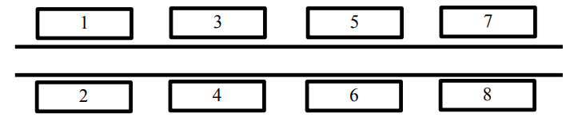

# Задачи для самостоятельного решения

Этот проект содержит несколько задач, каждая из которых имеет собственный набор тестов. 
Ниже приведены условия для каждой задачи и инструкции по запуску тестов.


## Условия задач

### Задача 1: [Улица]

**Описание задачи:**  
По одну сторону улицы находятся дома с нечётными номерами (1, 3, 5, …),
по другую сторону – с чётными (2, 4, 6, …). Дом № 1 находится напротив дома № 2,
дом № 3 – напротив дома № 4 и т. д. До соседнего дома нужно идти вдоль по улице одну
минуту, неважно, с какой стороны улицы он находится (то есть от дома № 1 нужно идти одну
минуту как до дома № 3, так и до дома № 4). До дома, стоящего напротив, идти не нужно.


Человек вышел на улицу из дома номер A и должен дойти до дома номер B.
Определите, сколько минут ему нужно идти вдоль по улице.
Программа получает на вход два различных целых положительных числа A и B,
не превосходящие 2×109
, – номера домов. Программа должна вывести одно число – искомое
количество минут.

**Пример входных данных:** 

| Ввод | Вывод |
|------|-------|
| 1    | 3     |
| 8    |       |

### Задача 2: [Надежное крепление]

**Описание задачи:**  
Уличный рекламный щит прикреплён к опоре при помощи трёх креплений. Первое
крепление может выдерживать ветер, скорость которого не превосходит A м/c, второе
крепление – B м/c, третье – C м/с. Сам щит будет надёжно закреплён, если как минимум два
крепления из трёх выдерживают ветер данной скорости. Определите максимальную скорость
ветра, которую выдержит данный щит.
Программа получает на вход три целых положительных числа A, B, С,
не превосходящие 2×10<sup>9</sup>, – допустимые скорости ветра, которые выдерживают три крепления
щита. Программа должна вывести одно число – максимальную скорость ветра, которую
выдержит щит.

**Пример входных данных:** 

| Ввод | Вывод |
|------|-------|
| 28   | 15    |
| 15   |       |
| 10   |       |

### Задача 3: [Парад]

**Описание задачи:**  
В параде принимают участие M военных. Командование парада решило, что наиболее
эффектное построение военных – в форме квадрата, то есть число участников построения
должно быть точным квадратом. Но поскольку число M может не быть точным квадратом,
разрешается разбить военных на несколько полков, каждый из которых строится в форме
квадрата. Для красоты все полки должны быть одинакового размера, также командование
парада хочет, чтобы размер каждого полка был как можно больше. Определите максимально
возможный размер полка.
Программа получает на вход одно целое положительное число M,
не превосходящее 2×10<sup>9</sup>
, – количество участников парад. Программа должна вывести одно
число – максимально возможный размер полка.

**Пример входных данных:** 

| Ввод | Вывод |
|------|-------|
| 180  | 36    |

### Задача 4: [Ряд чисел]

**Описание задачи:**  
Легенда гласит, что Карл Фридрих Гаусс, учась в школе, смог быстро посчитать
сумму целых чисел от 1 до 100, заметив, что 1 + 100 = 2 + 99 = … = 50 + 51. Теперь решите
задачу посложнее: можно ли перед каждым из чисел от 1 до N расставить знаки «+» или «–»
так, чтобы сумма получившихся чисел была равна 0? Например, для N = 3 сумма –1 –2 +3
будет равна 0, а для N = 2 этого сделать нельзя.
Программа получает на вход целое неотрицательное число N, не превосходящее 10<sup>5</sup>.
Программа должна вывести последовательность из N символов «+» или «–»,
соответствующих знакам, которые нужно расставить перед числами от 1 до N так, чтобы
сумма получившихся чисел была равна 0. Если задача имеет несколько решений, нужно
вывести один (лобой) ответ. Если задача не имеет решения для данного N, нужно вывести
одно слово «IMPOSSIBLE».».

**Пример входных данных:** 

| Ввод | Вывод      | Примечание                           |
|------|------------|--------------------------------------|
| 3    | --+        | Правильным ответом будет также «++-» |
| 2    | IMPOSSIBLE |                                      |

### Задача 5: [Клад]

**Описание задачи:**  
Путь к кладу задан в виде указаний, какое количество шагов нужно пройти в одном из
четырёх направлений: север (N), юг (S), запад (W), восток (E). Весь маршрут записан в виде
строки, содержащей последовательность из чисел и следующих за числами букв,
указывающих направление перемещения. Например, строка «7N5E2S3E» означает
пройти 7 шагов на север, 5 шагов на восток, 2 шага на юг, 3 шага на восток. В маршруте
может быть много команд перемещения, поэтому каждый такой маршрут можно сократить.
Например, ранее приведённый маршрут можно сократить до «5N8E». По данному маршруту
до клада сократите его до строки минимальной длины.

Программа получает на вход строку, состоящую из целых неотрицательных чисел,
не превосходящих 10<sup>7</sup> каждое, и одной буквы (N), юг (S), запад (W), восток (E), следующей за каждым
числом. Других символов (в том числе пробелов), кроме цифр и букв направлений,
в строке нет. Длина строки не превосходит 250 символов. Гарантируется, что начальная
и конечная точки маршрута различаются.

Программа должна вывести маршрут, ведущий в ту же точку, записанный в таком же
виде, как во входных данных, используя минимальное число символов. Если ответов
несколько, программа должна вывести один (любой) из них.

**Пример входных данных:** 

| Ввод      | Вывод  | Примечание                              |
|-----------|--------|-----------------------------------------|
| 7N5E2S3E  | 5N8E   | Правильным ответом будет также «8E5N»   |
| 10N30W20N | 30N30W | Правильным ответом будет также «30W30N» |


  

## Запуск тестов

Чтобы запустить тесты для конкретной задачи, выполните следующее:

Перейдите в директорию задачи. Например, для задачи 1:
   ```bash
    cd task1
    python test_runner.py
   ```

